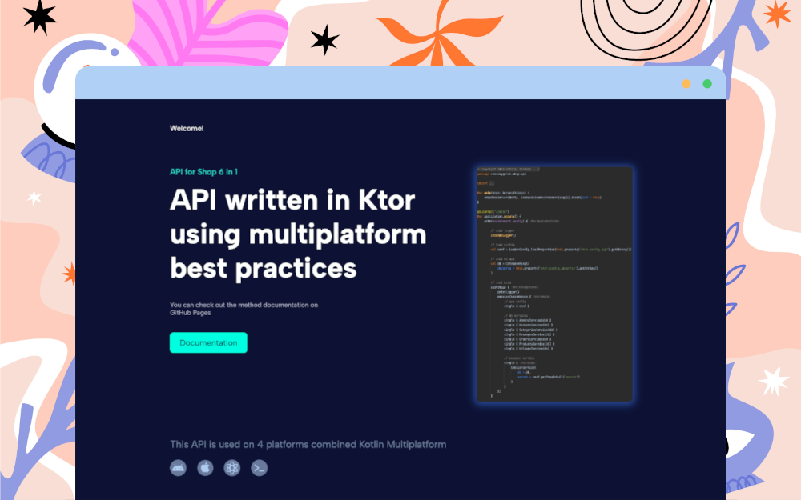
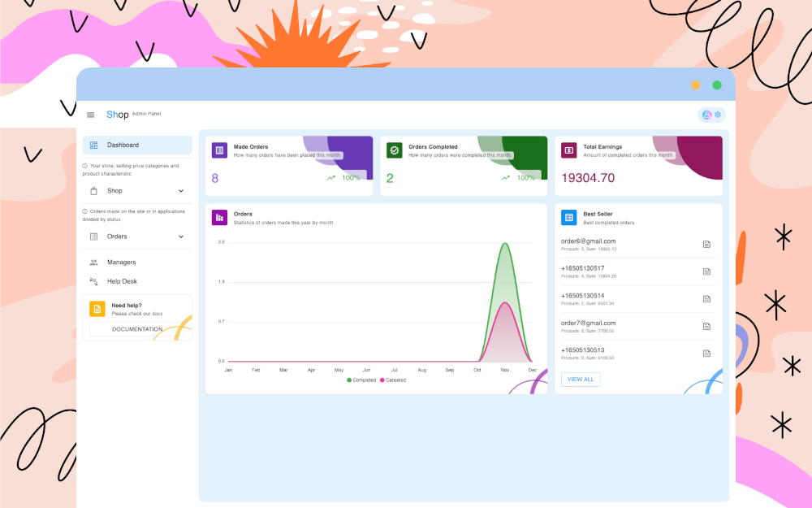
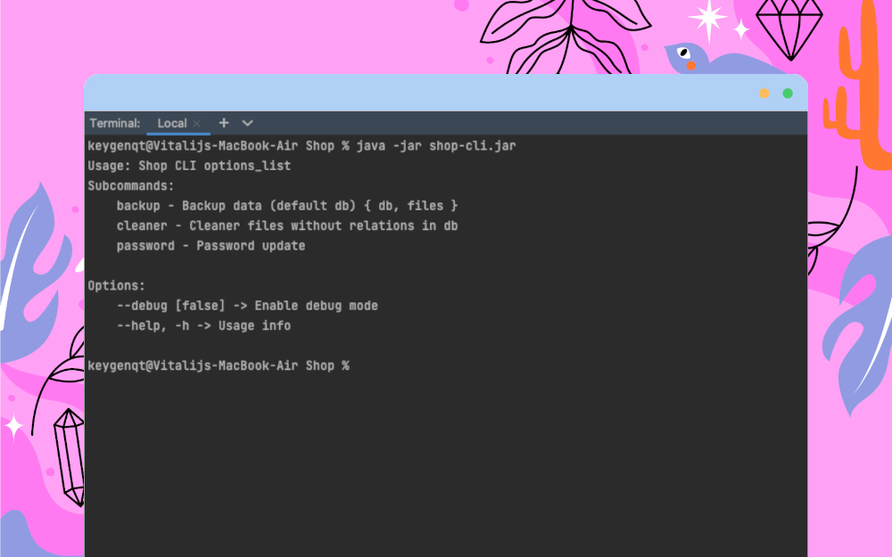
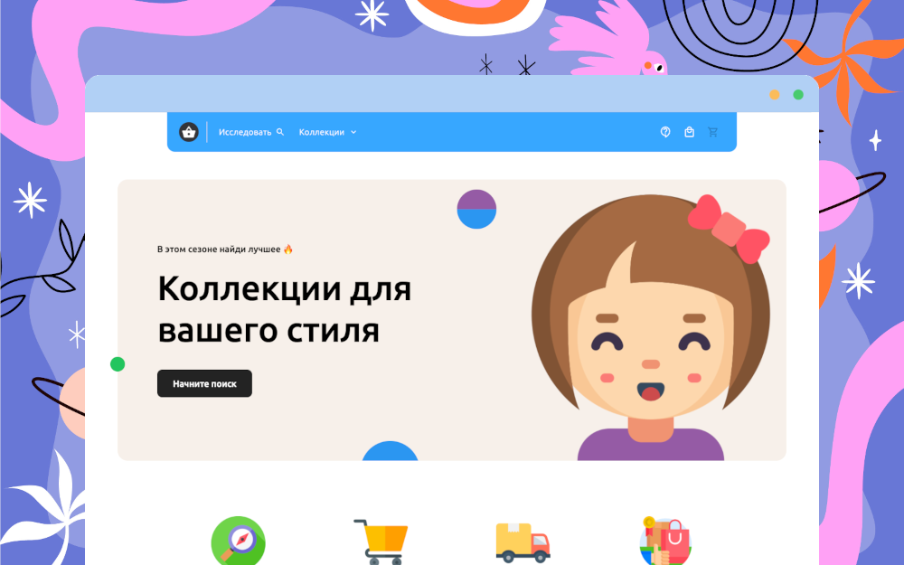

Shop 6 in 1 (You Shop)
===================

A store that includes 6 applications written using [Kotlin Multiplatform](https://kotlinlang.org/docs/multiplatform.html).
All applications use a common module and native UI for their platforms.
All platforms use the latest stack.


### Roadmap

1. Make an API ✅
2. Write admin panel ✅
3. CLI application for the server ✅
4. Write a website for clients ✅
5. Write an Android application ✅
6. Write an iOS application ✅
7. Finalization, documentation, production ⌛ (60%)

## 1. API

* Url: [Link](https://shop-api.keygenqt.com/)
* Based: [Ktor](https://ktor.io/)
* Platform: **Web**
* Documentation: [Link](https://keygenqt.github.io/km-shop/api/)



## 2. Admin Panel

* Youtube: [Link](https://youtu.be/8jI0T45MMoQ)
* Url: [Link](https://shop-admin.keygenqt.com/)
* Based: [React](https://reactjs.org/)
* Platform: **Web**
* Documentation: [Link](https://keygenqt.github.io/km-shop/backend/)



## 3. CLI App

* Url: [Link](https://github.com/keygenqt/km-shop/blob/master/data/cli/shop-cli.jar?raw=true)
* Based: [kotlinx-cli](https://github.com/Kotlin/kotlinx-cli)
* Platform: **Native**
* Documentation: [Link](https://keygenqt.github.io/km-shop/cli/)



## 4. Website

* Youtube: [Link](https://youtu.be/sHN1-LRDH64)
* Url: [Link](https://shop.keygenqt.com/)
* Based: [React](https://reactjs.org/)
* Platform: **Web**
* Documentation: [Link](https://keygenqt.github.io/km-shop/frontend/)



## 5. Android App

* Youtube: [Link](https://youtu.be/0zEC6xX8T-c)
* Url: *Coming soon*
* Based: [Jetpack Compose](https://developer.android.com/jetpack/compose)
* Platform: **Android**
* Documentation: [Link](https://keygenqt.github.io/km-shop/android/)

#### Preview

<p>


</p>

## 6. iOS App

* Url: *Coming soon*
* Based: [SwiftUI](https://developer.apple.com/xcode/swiftui/)
* Platform: **iOS**
* Documentation: [Link](https://keygenqt.github.io/km-shop/ios/)

#### Preview

<p>


</p>

# License

```
Copyright 2022 Vitaliy Zarubin

Licensed under the Apache License, Version 2.0 (the "License");
you may not use this file except in compliance with the License.
You may obtain a copy of the License at

    http://www.apache.org/licenses/LICENSE-2.0

Unless required by applicable law or agreed to in writing, software
distributed under the License is distributed on an "AS IS" BASIS,
WITHOUT WARRANTIES OR CONDITIONS OF ANY KIND, either express or implied.
See the License for the specific language governing permissions and
limitations under the License.
```